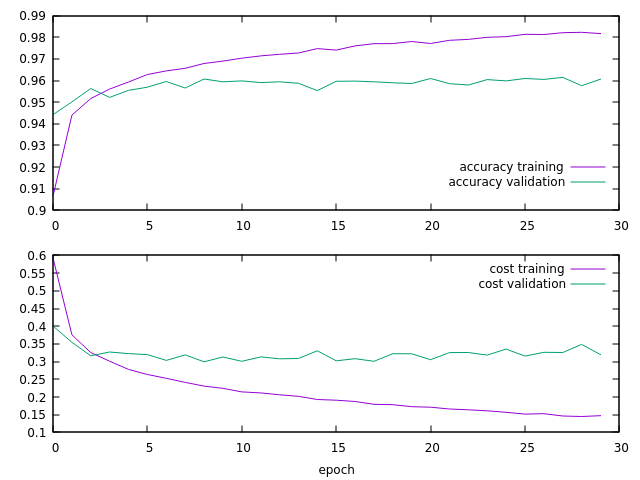
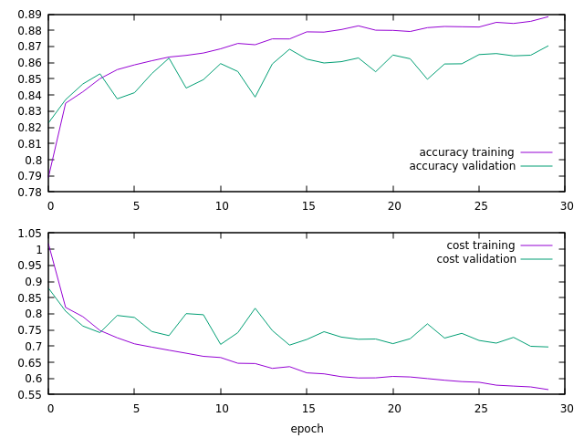

# CML

Machine Learning Methods, written in C++

## Training on the MNIST Data Set

- 748 inputs, 10 outputs, 30 hidden neurons
- sigmoid activation function
- cross-entropy cost + regularization
- 50000 training images, 10000 validation images, 10000 test images
- Accuracy on test set: 95.88%

## Training on the MNIST-Fashion Data Set

- 748 inputs, 10 outputs, 30 hidden neurons
- sigmoid activation function
- cross-entropy cost + regularization
- 50000 training images, 10000 validation images, 10000 test images
- Accuracy on test set: 85.98%

